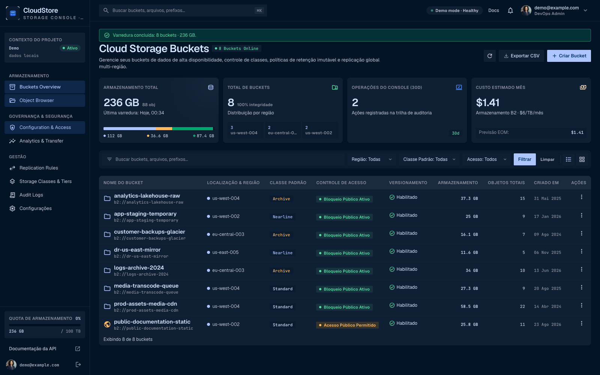

# CloudStore

Storage console for **Backblaze B2 Cloud Storage**: browse buckets and objects, upload and delete
files, edit lifecycle/CORS governance, and keep a local audit trail. Built with
[amarra-cais](https://github.com/puppe1990/amarra-cais) — Go + Amarra Views + Drive + SQLite, no SPA
and no front-end build step.

**Live:** https://cloudstore.apps.gestaobem.com — runs in demo mode until a B2 application key is
connected in Settings (sign up first; production ships no seeded user).



## What it does

- **Buckets overview** — create/delete buckets; per-bucket region, lifecycle-derived class, access
  state, scanned storage and object counts, quota gauge and cost estimate ($6/TB/month).
- **Object browser** — folder navigation, prefix search, multipart uploads, folder creation, bulk
  delete, and a detail panel with metadata, ETag (MD5/SHA-1), cache-control, retention and
  presigned download links (B2 download authorization) with 15 min / 1 h / 24 h TTLs.
- **Configuration & access** — lifecycle rules (hide/delete windows) and CORS rules edited as B2
  JSON, plus SSE-B2/Object Lock/versioning surfaced per bucket.
- **Analytics** — 30-day storage curve, class split, status distribution and maintenance history,
  all derived from the console's own audit trail.
- **Audit log** — every console operation with actor, target, detail and status.
- **Accounts** — B2 application keys are sealed with AES-256-GCM under `APP_SECRET` before they
  touch SQLite. Without an active account the console runs on generated demo data so every screen
  stays usable.
- **PWA + link previews** — manifest, service worker, maskable icons, offline page and
  Open Graph/Twitter metadata for shared links.

## Stack

| Layer     | Choice                                                              |
| --------- | ------------------------------------------------------------------- |
| Language  | Go 1.26 (`net/http` stdlib)                                         |
| Framework | [amarra-cais](https://github.com/puppe1990/amarra-cais) v0.12       |
| Front end | Amarra Views + Drive (`amarra.js`), Tailwind CSS 3                  |
| Storage   | SQLite (`modernc.org/sqlite`, no CGO)                               |
| Providers | Backblaze B2 Native API v4 (`internal/storage/b2`)                  |
| Demo data | `gofakeit`-backed in-memory provider (`internal/storage/fakestore`) |
| Fonts     | Self-hosted Geist, JetBrains Mono, Material Symbols                 |

## Quick start

```bash
cp .env.example .env      # set APP_SECRET (required in production)
amarra-cais install       # npm install + go mod tidy + Tailwind
amarra-cais dev           # http://localhost:8080
```

Development login: `demo@example.com` / `password`.

Point the console at a real account either from **Settings → Storage Accounts** (application key +
region) or by exporting `B2_KEY_ID` / `B2_APP_KEY` / `B2_REGION` before boot — a fresh install with
those variables gets an active account automatically.

## Environment variables

| Variable                         | Default         | Description                                                    |
| -------------------------------- | --------------- | -------------------------------------------------------------- |
| `PORT`                           | `:8080`         | HTTP port (auto-shifts when busy)                              |
| `ENV`                            | `development`   | `production` enforces `APP_SECRET` + secure cookies            |
| `APP_URL`                        | —               | Absolute URL for OG images/canonical links (required in prod)  |
| `LOCALE`                         | `pt`            | Default UI language (`pt` or `en`)                             |
| `DB_PATH`                        | `./data/app.db` | SQLite file                                                    |
| `APP_SECRET`                     | —               | Key material that seals B2 application keys (required in prod) |
| `CLOUDSTORE_QUOTA_BYTES`         | `100 TB`        | Quota shown in the sidebar gauge                               |
| `B2_KEY_ID` / `B2_APP_KEY`       | —               | Optional B2 application key seeded on boot                     |
| `B2_REGION` / `B2_ACCOUNT_LABEL` | —               | Optional label/region for the seeded account                   |
| `MAX_BODY_BYTES`                 | `33554432`      | Request-body cap (raise for larger uploads)                    |
| `ADMIN_TOKEN`                    | —               | Required by `cfg.Validate()` in production                     |

## Commands

| Command                            | What it does                                |
| ---------------------------------- | ------------------------------------------- |
| `amarra-cais dev`                  | air + Tailwind watch on :8080               |
| `amarra-cais test`                 | `go test ./...`                             |
| `amarra-cais css` / `make css`     | Rebuild Tailwind into `web/static/css`      |
| `amarra-cais build` / `make build` | Compile `bin/server`                        |
| `amarra-cais doctor [--mobile]`    | Verify wiring, PWA assets and mobile checks |
| `amarra-cais pwa --bump`           | Refresh PWA runtime + cache version         |
| `npm run fonts`                    | Copy the self-hosted woff2 files            |
| `make ci`                          | test + lint + format-check                  |

## Tests

TDD is the contract here: the domain modules were written test-first (red → green) and every screen
has a headless handler test.

| Package                      | Coverage                                                     |
| ---------------------------- | ------------------------------------------------------------ |
| `internal/format`            | byte/count/date/money/ratio formatting, faker property tests |
| `internal/storage`           | bucket-name rules, lifecycle→class derivation                |
| `internal/storage/b2`        | full B2 v4 wire contract against an `httptest` stub          |
| `internal/storage/fakestore` | deterministic gofakeit demo dataset                          |
| `internal/store`             | SQLite `:memory:` — accounts, audit, scans, usage            |
| `internal/console`           | provider/store orchestration, demo history seeding           |
| `internal/handlers`          | every page renders + create/delete/upload/save flows         |

```bash
go test ./... -race -count=1
```

Fixtures come from `gofakeit`; `fakedata.Seed(42)` pins reproducible sequences in tests.

## CI, hooks and deploy

- `.github/workflows/ci.yml` runs Go tests (`-race`), `golangci-lint`, Prettier and `npm test`.
- `.pre-commit-config.yaml` keeps the same gate locally (`pre-commit install`).
- Deploy: `amarra-cais build --os linux --arch amd64 -o bin/server-linux`, ship `web/static` beside
  the binary, run under systemd (`deploy/systemd/cais-app.service.example`), then
  `amarra-cais pwa --bump` after asset changes.
